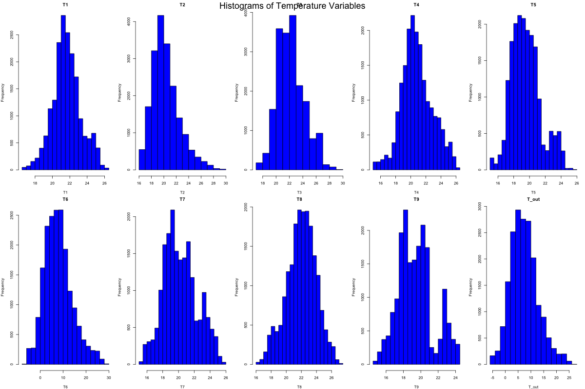
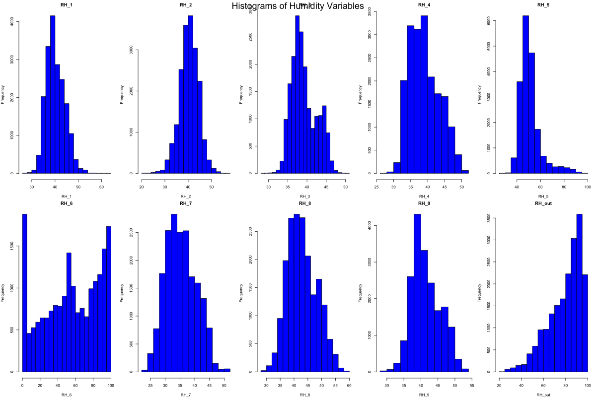
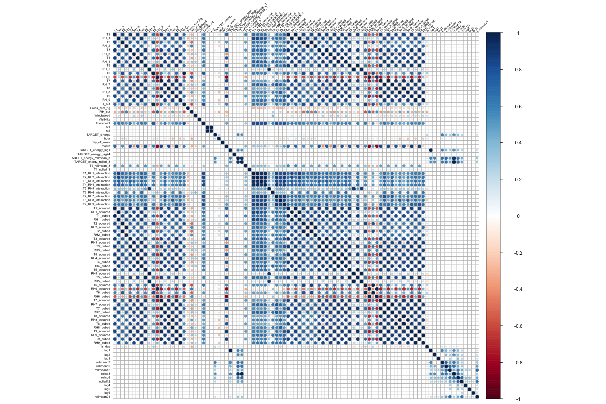
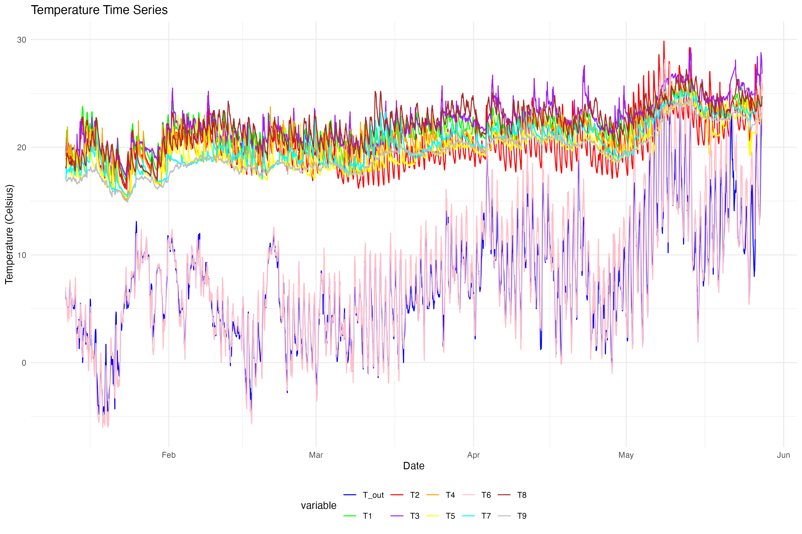
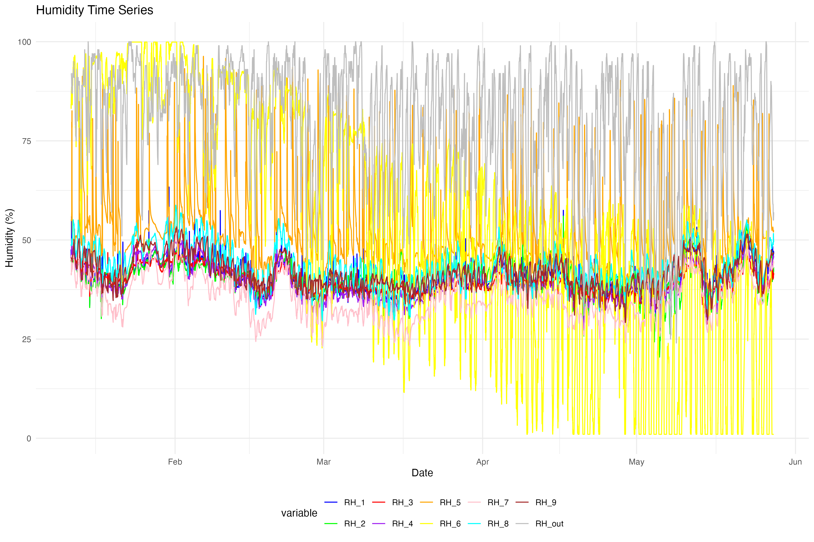
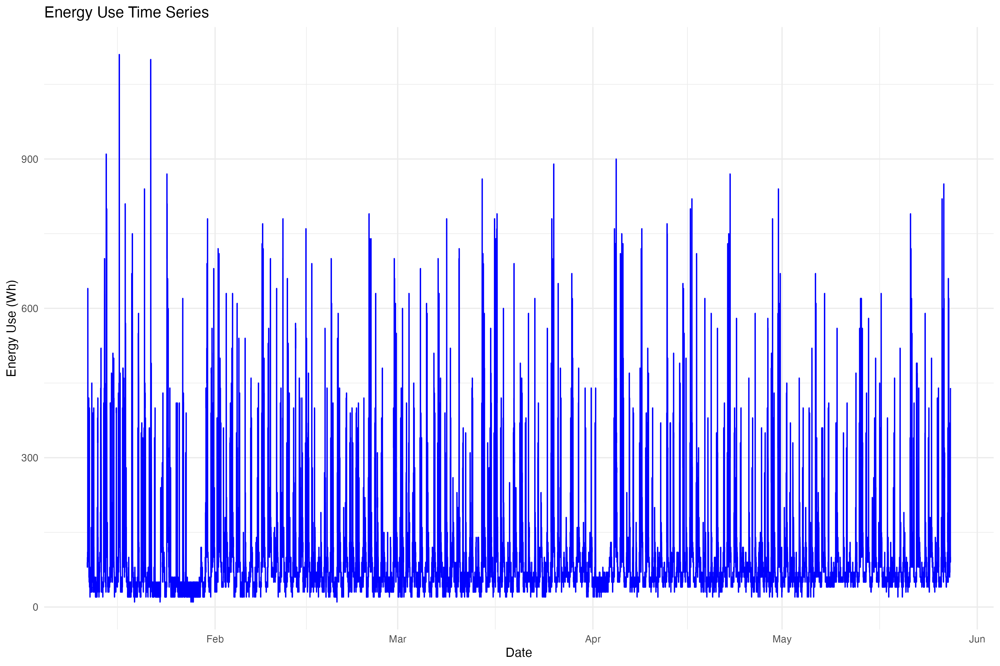

# Energy Consumption Prediction

This project aims to predict energy consumption using various machine learning models. The following document details the data preprocessing, feature engineering, model training, evaluation, and validation processes.

## Dataset Overview

The dataset used in this project contains hourly measurements of energy consumption and various environmental factors. Each record includes: 

- **Date**: The timestamp of the observation.
- **TARGET_energy**: The energy consumption at the given time.
- **T1 to T9**: Temperature readings from nine different sensors.
- **RH_1 to RH_9**: Relative humidity readings from nine different sensors.
- **T_out**: Outside temperature.
- **Press_mm_hg**: Atmospheric pressure.
- **RH_out**: Outside relative humidity.
- **Windspeed**: Wind speed.
- **Visibility**: Visibility in meters.
- **Tdewpoint**: Dew point temperature.

## Exploratory Data Analysis (EDA)

### Histograms of Temperature Variables

### Histograms of Humidity Variables

### Correlation Heatmap

The correlation heatmap visualizes the relationships between various numerical variables in the dataset.

### Time Series Analysis

#### Temperature Time Series

The temperature time series plot visualizes the variations in temperature levels across different rooms and the outside environment over time.

#### Humidity Time Series

The humidity time series plot visualizes the variations in humidity levels across different rooms and the outside environment over time.

#### Energy Use Time Series

The energy use time series plot visualizes the variations in energy consumption over time.

### Analysis of Temperature Variables

- **Kitchen (T1)**: Distribution is approximately normal with a peak around 22°C.
- **Living Room (T2)**: Slightly right-skewed distribution with a peak around 21°C.
- **Laundry Room (T3)**: Approximately normal distribution with a peak around 24°C.
- **Office Room (T4)**: Normal distribution with a peak around 21°C.
- **Bathroom (T5)**: Approximately normal distribution with a peak around 22°C.
- **Outside North (T6)**: Right-skewed distribution with a peak around 10°C.
- **Ironing Room (T7)**: Approximately normal distribution with a peak around 21°C.
- **Teenager Room 2 (T8)**: Normal distribution with a peak around 22°C.
- **Parents Room (T9)**: Approximately normal distribution with a peak around 21°C.
- **Outside (Chievres, T_out)**: Right-skewed distribution with a peak around 10°C.

### Analysis of Humidity Variables

- **Kitchen (RH_1)**: Normal distribution with a peak around 40%.
- **Living Room (RH_2)**: Normal distribution with a peak around 35%.
- **Laundry Room (RH_3)**: Normal distribution with a peak around 40%.
- **Office Room (RH_4)**: Normal distribution with a peak around 35%.
- **Bathroom (RH_5)**: Right-skewed distribution with a peak around 60%.
- **Outside North (RH_6)**: Bi-modal distribution with peaks around 15% and 80%.
- **Ironing Room (RH_7)**: Normal distribution with a peak around 35%.
- **Teenager Room 2 (RH_8)**: Normal distribution with a peak around 45%.
- **Parents Room (RH_9)**: Normal distribution with a peak around 45%.
- **Outside (Chievres, RH_out)**: Right-skewed distribution with a peak around 80%.

### Analysis of Additional Numerical Variables

- **Pressure (Chievres)**: Approximately normal distribution with a peak around 760 mm Hg.
- **Wind Speed (Chievres)**: Right-skewed distribution with a peak around 2 m/s.
- **Visibility (Chievres)**: Bi-modal distribution with peaks around 30 km and 40 km.
- **Dewpoint (Chievres)**: Approximately normal distribution with a peak around 5°C.
- **Random Variable 1 (rv1)**: Uniform distribution across the range.
- **Random Variable 2 (rv2)**: Uniform distribution across the range.
- **Energy Use (Wh)**: Right-skewed distribution with a peak around 50 Wh.

### Conclusion of EDA

The EDA provides valuable insights into the behavior of temperature, humidity, and energy use in the building. Understanding these patterns is crucial for developing predictive models and implementing energy-saving measures.

This project aims to predict energy consumption using various machine learning models. The following document details the data preprocessing, feature engineering, model training, evaluation, and validation processes.

## Dataset Overview

The dataset used in this project contains hourly measurements of energy consumption and various environmental factors. Each record includes:

- **Date**: The timestamp of the observation.
- **TARGET_energy**: The energy consumption at the given time.
- **T1 to T9**: Temperature readings from nine different sensors.
- **RH_1 to RH_9**: Relative humidity readings from nine different sensors.
- **T_out**: Outside temperature.
- **Press_mm_hg**: Atmospheric pressure.
- **RH_out**: Outside relative humidity.
- **Windspeed**: Wind speed.
- **Visibility**: Visibility in meters.
- **Tdewpoint**: Dew point temperature.

## Feature Engineering

To enhance the predictive power of our models, we engineered several new features:

- **Lagged Features**: These capture the previous values of the target variable (e.g., `lag1`, `lag2`, `lag3`).
  - *Example*: `lag1` represents the energy consumption one hour before the current timestamp.
- **Rolling Statistics**: These provide smoothed versions of the target variable over different windows (e.g., `rollmean3`, `rollmean6`, `rollmean12`).
  - *Example*: `rollmean3` is the rolling mean of energy consumption over the past three hours.
- **Interactions and Polynomials**: These include interaction terms between temperature and humidity sensors (e.g., `T1_RH1_interaction`) and polynomial terms (e.g., `T1_squared`, `RH1_cubed`).
  - *Example*: `T1_RH1_interaction` represents the product of temperature sensor 1 and humidity sensor 1.

These engineered features help capture temporal dependencies and complex relationships between variables, which can improve model accuracy.

## Performance Metrics

To evaluate the performance of the models, we used three key metrics:

1. **Root Mean Squared Error (RMSE)**:
   - **Definition**: RMSE measures the square root of the average of the squared differences between the predicted and actual values.
   - **Interpretation**: Lower RMSE values indicate better model performance. RMSE is sensitive to outliers and provides a measure of the typical prediction error in the same units as the target variable.

2. **Mean Absolute Error (MAE)**:
   - **Definition**: MAE measures the average of the absolute differences between the predicted and actual values.
   - **Interpretation**: Lower MAE values indicate better model performance. MAE is less sensitive to outliers compared to RMSE and provides a straightforward measure of prediction accuracy.

3. **Coefficient of Determination (R²)**:
   - **Definition**: R² measures the proportion of the variance in the target variable that is predictable from the independent variables.
   - **Interpretation**: R² values range from 0 to 1, with higher values indicating better model performance. An R² value of 1 indicates perfect prediction, while an R² value of 0 indicates that the model does not explain any of the variance in the target variable.

### Metrics Interpretation

Performance metrics like RMSE, MAE, and R² provide a quantitative measure of the model's accuracy but may not fully capture its effectiveness in real-world scenarios. These metrics are based on historical data and might not reflect future changes or anomalies in energy consumption patterns.

## Models and Performance

We trained and evaluated several machine learning models on the engineered features. The models include:

- **Random Forest Final (Tuned with Feature Selection)**:
  - RMSE: 43.23051
  - MAE: 24.63652
  - R²: 0.8303284
- **Random Forest (Only Feature Selection)**:
  - RMSE: 55.60064
  - MAE: 30.4344
  - R²: 0.7183661
- **LSTM (Tuned)**:
  - RMSE: 77.32212
  - MAE: 43.84375
  - R²: 0.4556434
- **LSTM**:
  - RMSE: 78.34101
  - MAE: 43.83427
  - R²: 0.4412025
- **Tuned Gradient Boosting**:
  - RMSE: 64.21605
  - MAE: 34.58222
  - R²: 0.6293279
- **Tuned Random Forest (General feature selection)**:
  - RMSE: 58.67541
  - MAE: 28.60143
  - R²: 0.6927204
- **Gradient Boosting**:
  - RMSE: 75.55071
  - MAE: 44.29758
  - R²: 0.4995187
- **Random Forest**:
  - RMSE: 58.91217
  - MAE: 28.63226
  - R²: 0.690126
- **Linear Regression**:
  - RMSE: 74.48276
  - MAE: 42.76741
  - R²: 0.5010507

### Feature Importance for Random Forest Final

The feature importance graph below shows the most significant features used in the Random Forest Final model:

### Performance Comparison

## Model Limitations

While our models demonstrate good performance in predicting energy consumption, it's crucial to understand their limitations. This helps in setting realistic expectations and identifying areas for potential improvement.

### Data Limitations

- **Dataset Size and Quality**:
  - The dataset used may not be fully representative of all possible scenarios in energy consumption. It might contain inherent biases or lack sufficient diversity, which can affect the model's ability to generalize. The presence of missing values and noise in the data can also impact the model's predictive accuracy.

### Model-Specific Limitations

- **Random Forest Final (Tuned with Feature Selection)**:
  - **Performance**: RMSE: 43.23051, MAE: 24.63652, R²: 0.8303284
  - **Limitation**: While this model performs the best among the tested models, it may struggle with extrapolating beyond the range of training data. It can also be less interpretable compared to simpler models. The complexity of the model might lead to longer training times and higher computational requirements.

### Generalizability

- **Scope and Diversity**:
  - The models were trained on a specific dataset, which might not capture all variations in energy consumption patterns. They may not generalize well to different regions, climates, or building types. Seasonal variations and external factors (e.g., economic changes, policy impacts) not present in the training data can affect the model's accuracy.

### Computational Requirements

- **Resource Intensive**:
  - Models like LSTM and Gradient Boosting require significant computational resources for training and tuning. This can be a limitation for deploying the model in resource-constrained environments.

Understanding these limitations helps in setting realistic expectations and highlights areas for future improvements and research.

### Conclusion
This project demonstrates the process of predicting energy consumption using various machine learning models, including feature engineering, model training, hyperparameter tuning, and evaluation. While Random Forest (Tuned with Feature Selection) provided the best performance, each model has its strengths and limitations
