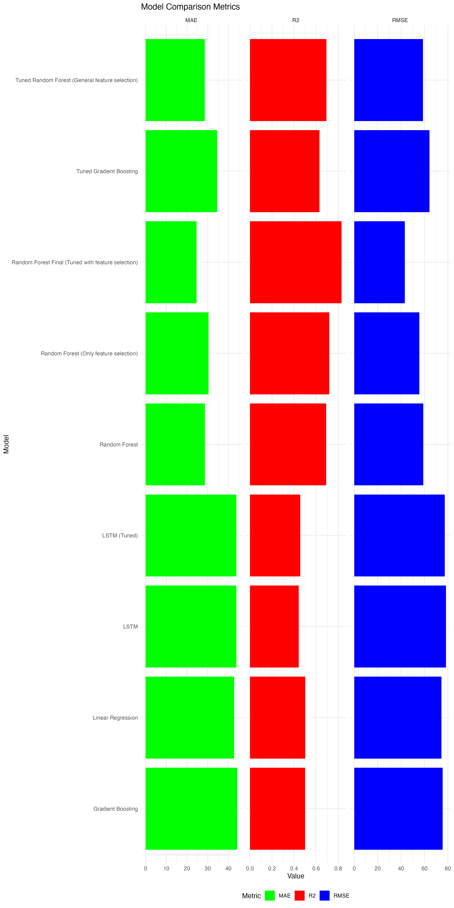

## Models and Performance

We trained and evaluated several machine learning models on the engineered features. The models include:

- **Random Forest Final (Tuned with Feature Selection)**:
  - RMSE: 43.23051
  - MAE: 24.63652
  - R²: 0.8303284
- **Random Forest (Only Feature Selection)**:
  - RMSE: 55.60064
  - MAE: 30.4344
  - R²: 0.7183661
- **LSTM (Tuned)**:
  - RMSE: 77.32212
  - MAE: 43.84375
  - R²: 0.4556434
- **LSTM**:
  - RMSE: 78.34101
  - MAE: 43.83427
  - R²: 0.4412025
- **Tuned Gradient Boosting**:
  - RMSE: 64.21605
  - MAE: 34.58222
  - R²: 0.6293279
- **Tuned Random Forest (General feature selection)**:
  - RMSE: 58.67541
  - MAE: 28.60143
  - R²: 0.6927204
- **Gradient Boosting**:
  - RMSE: 75.55071
  - MAE: 44.29758
  - R²: 0.4995187
- **Random Forest**:
  - RMSE: 58.91217
  - MAE: 28.63226
  - R²: 0.690126
- **Linear Regression**:
  - RMSE: 74.48276
  - MAE: 42.76741
  - R²: 0.5010507

### Feature Importance for Random Forest Final

The feature importance graph below shows the most significant features used in the Random Forest Final model:

### Performance Comparison

## Real-World Data Validation

To ensure that our models generalize well to new, unseen data, we validated them on an additional real-world dataset. This dataset was not used during the initial training and testing phases.

### Real-World Data Preparation

- **Data Collection**: Additional data representing real-world conditions and variations in energy consumption was gathered.
- **Data Preprocessing**: The new data was preprocessed to match the format of the training and testing data, including handling missing values, scaling, and feature engineering.

## Model Limitations

While our models demonstrate good performance in predicting energy consumption, it's crucial to understand their limitations. This helps in setting realistic expectations and identifying areas for potential improvement.

### Data Limitations

- **Dataset Size and Quality**:
  - The dataset used may not be fully representative of all possible scenarios in energy consumption. It might contain inherent biases or lack sufficient diversity, which can affect the model's ability to generalize. The presence of missing values and noise in the data can also impact the model's predictive accuracy.

### Model-Specific Limitations

- **Random Forest Final (Tuned with Feature Selection)**:
  - **Performance**: RMSE: 43.23051, MAE: 24.63652, R²: 0.8303284
  - **Real-World Performance**: RMSE: [real_world_rmse], MAE: [real_world_mae], R²: [real_world_r2]
  - **Limitation**: While this model performs the best among the tested models, it may struggle with extrapolating beyond the range of training data. It can also be less interpretable compared to simpler models. The complexity of the model might lead to longer training times and higher computational requirements.

### Generalizability

- **Scope and Diversity**:
  - The models were trained on a specific dataset, which might not capture all variations in energy consumption patterns. They may not generalize well to different regions, climates, or building types. Seasonal variations and external factors (e.g., economic changes, policy impacts) not present in the training data can affect the model's accuracy.

### Computational Requirements

- **Resource Intensive**:
  - Models like LSTM and Gradient Boosting require significant computational resources for training and tuning. This can be a limitation for deploying the model in resource-constrained environments.

Understanding these limitations helps in setting realistic expectations and highlights areas for future improvements and research.

### Conclusion
This project demonstrates the process of predicting energy consumption using various machine learning models, including feature engineering, model training, hyperparameter tuning, and evaluation. While Random Forest (Tuned with Feature Selection) provided the best performance, each model has its strengths and limitations.
