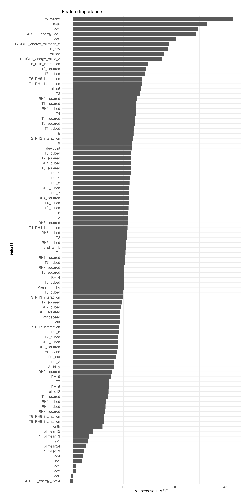

# Energy Consumption Prediction

This project involves predicting energy consumption using various machine learning models. The models have been trained and evaluated based on a set of features extracted from the dataset. The primary goal is to identify the best-performing model and optimize it for better prediction accuracy.

## Project Overview

The following steps were taken in this project:

1. **Feature Engineering**: Creating meaningful features to improve model performance.
2. **Model Training**: Training different machine learning models on the selected features.
3. **Model Evaluation**: Evaluating the performance of the trained models using appropriate metrics.
4. **Hyperparameter Tuning**: Optimizing the hyperparameters of the best-performing model.
5. **Model Interpretation and Analysis**: Interpreting the results and analyzing the model's performance.

## Models and Performance

The models used in this project and their performance metrics are as follows:

- **Random Forest Final (Tuned with Feature Selection)**: 
  - RMSE: 43.23051
  - MAE: 24.63652
  - R²: 0.8303284

- **Random Forest (Only Feature Selection)**:
  - RMSE: 55.60064
  - MAE: 30.4344
  - R²: 0.7183661

- **LSTM (Tuned)**:
  - RMSE: 77.32212
  - MAE: 43.84375
  - R²: 0.4556434

- **LSTM**:
  - RMSE: 78.34101
  - MAE: 43.83427
  - R²: 0.4412025

- **Tuned Gradient Boosting**:
  - RMSE: 64.21605
  - MAE: 34.58222
  - R²: 0.6293279

- **Tuned Random Forest (General Feature Selection)**:
  - RMSE: 58.67541
  - MAE: 28.60143
  - R²: 0.6927204

- **Gradient Boosting**:
  - RMSE: 75.55071
  - MAE: 44.29758
  - R²: 0.4995187

- **Random Forest**:
  - RMSE: 58.91217
  - MAE: 28.63226
  - R²: 0.690126

- **Linear Regression**:
  - RMSE: 74.48276
  - MAE: 42.76741
  - R²: 0.5010507

## Feature Engineering

### Lagged Features

- `lag1`, `lag2`, `lag3`, `lag4`, `lag5`, `lag6`

### Rolling Statistics

- `rollmean3`, `rollmean6`, `rollmean12`, `rollmean24`

## Hyperparameter Tuning

Hyperparameter tuning was performed for the Random Forest and Gradient Boosting models to optimize their performance.

## Feature Importance

## Model Comparison

## Model Limitations

While our models demonstrate good performance in predicting energy consumption, it's crucial to understand their limitations. This helps in setting realistic expectations and identifying areas for potential improvement.

### Data Limitations

- **Dataset Size and Quality:**
  - The dataset used may not be fully representative of all possible scenarios in energy consumption. It might contain inherent biases or lack sufficient diversity, which can affect the model's ability to generalize. The presence of missing values and noise in the data can also impact the model's predictive accuracy.

### Model-Specific Limitations

- **Random Forest Final (Tuned with Feature Selection):**
  - **Performance:** RMSE: 43.23051, MAE: 24.63652, R²: 0.8303284
  - **Limitation:** While this model performs the best among the tested models, it may struggle with extrapolating beyond the range of training data. It can also be less interpretable compared to simpler models. The complexity of the model might lead to longer training times and higher computational requirements.

- **Random Forest (Only Feature Selection):**
  - **Performance:** RMSE: 55.60064, MAE: 30.4344, R²: 0.7183661
  - **Limitation:** This model, although effective, may not capture complex interactions between features as effectively as the tuned version. The absence of hyperparameter tuning can result in suboptimal performance.

- **LSTM (Tuned):**
  - **Performance:** RMSE: 77.32212, MAE: 43.84375, R²: 0.4556434
  - **Limitation:** LSTMs require extensive hyperparameter tuning, which can be computationally intensive and time-consuming. They are also prone to overfitting, especially with limited or noisy data. Additionally, LSTMs may not perform well with small datasets or datasets with non-sequential dependencies.

- **LSTM:**
  - **Performance:** RMSE: 78.34101, MAE: 43.83427, R²: 0.4412025
  - **Limitation:** Similar to the tuned LSTM, this model's performance heavily depends on the quality and amount of training data. The model may not generalize well to unseen data due to its complexity and the potential for overfitting.

- **Tuned Gradient Boosting:**
  - **Performance:** RMSE: 64.21605, MAE: 34.58222, R²: 0.6293279
  - **Limitation:** Gradient Boosting models are sensitive to hyperparameter settings and can overfit if not tuned properly. They are also slower to train compared to Random Forests and require significant computational resources.

- **Tuned Random Forest (General Feature Selection):**
  - **Performance:** RMSE: 58.67541, MAE: 28.60143, R²: 0.6927204
  - **Limitation:** This model, while effective, does not perform as well as the specifically tuned version. General feature selection may miss important interactions between features, leading to lower performance.

- **Gradient Boosting:**
  - **Performance:** RMSE: 75.55071, MAE: 44.29758, R²: 0.4995187
  - **Limitation:** Without tuning, Gradient Boosting may not perform optimally and can be prone to overfitting. It requires significant computational resources for training and can be sensitive to noise and outliers in the data.

- **Random Forest:**
  - **Performance:** RMSE: 58.91217, MAE: 28.63226, R²: 0.690126
  - **Limitation:** This model may not capture complex feature interactions as effectively as the tuned version. It also has limitations in extrapolating beyond the training data range and may require substantial computational resources for large datasets.

- **Linear Regression:**
  - **Performance:** RMSE: 74.48276, MAE: 42.76741, R²: 0.5010507
  - **Limitation:** Linear Regression assumes a linear relationship between the features and the target variable, which may not capture the true underlying patterns in the data. This can lead to lower performance compared to more complex models. Additionally, it is sensitive to multicollinearity and outliers.

### Generalizability

- **Scope and Diversity:**
  - The models were trained on a specific dataset, which might not capture all variations in energy consumption patterns. They may not generalize well to different regions, climates, or building types. Seasonal variations and external factors (e.g., economic changes, policy impacts) not present in the training data can affect the model's accuracy.

### Performance Metrics

- **Metrics Interpretation:**
  - Performance metrics like RMSE, MAE, and R² provide a quantitative measure of the model's accuracy but may not fully capture its effectiveness in real-world scenarios. These metrics are based on historical data and might not reflect future changes or anomalies in energy consumption patterns.

### Computational Requirements

- **Resource Intensive:**
  - Models like LSTM and Gradient Boosting require significant computational resources for training and tuning. This can be a limitation for deploying the model in resource-constrained environments.

Understanding these limitations helps in setting realistic expectations and highlights areas for future improvements and research.
